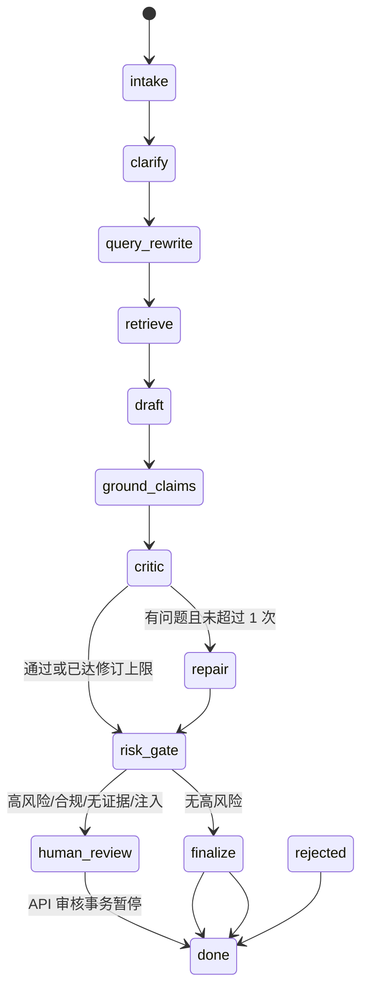

# Agent 设计与生产化边界

## 设计原则

1. **显式状态优先**：每一步都有输入、输出和可观察事件，避免一个不可解释的大 Prompt。
2. **工具最小权限**：Agent 只能搜索知识、校验证据、估算容量输入和比较部署路径；不提供任意代码执行、生产写入或外发消息工具。
3. **证据绑定**：产品能力结论必须绑定 `evidence_id` 和来源路径；没有证据时转成风险和澄清问题。
4. **人机协同**：高风险、数据出域、合规约束、疑似注入或缺少知识覆盖时暂停，等待人工审核。
5. **可恢复**：每个线程保存 checkpoint，审核后从风险门继续，而不是重新生成一份不可对比的答案。
6. **可替换模型**：应用层通过结构化契约和 OpenAI-compatible API 与 Dify、云 API、vLLM、llama.cpp 解耦。

## LangGraph 状态图



## 节点职责

| 节点 | 主要输入 | 主要输出 | 失败处理 |
|---|---|---|---|
| `intake` / `clarify` | `CustomerBriefV2` | 安全输入策略、缺失字段、澄清问题 | 标记缺失字段，不猜测客户约束 |
| `query_rewrite` / `retrieve` | 需求与租户/角色 | 查询、ACL 过滤后的证据 | 空召回进入知识覆盖风险 |
| `draft` / `ground_claims` | 证据与需求 | 本地模型草案、可验证 claim | 丢弃未知 evidence ID |
| `critic` / `repair` | 草案、证据 | 问题清单、最多一次修订 | 失败进入 `model_unavailable`/审核 |
| `risk_gate` | 全部状态 | `waiting_for_review` 或放行 | 代码强制高风险停下 |
| `human_review` | 持久化状态 | reviewer、角色、理由、版本、幂等键 | 乐观锁防止重复覆盖 |
| `finalize` | 审核状态与全量状态 | `SolutionResponseV2` | schema、敏感数据和承诺策略阻断 |

## 状态与恢复

本仓库的 v2 运行时用真实 LangGraph `StateGraph` 编排节点。Compose 的 PostgreSQL 路径同时使用官方 `PostgresSaver` 保存图状态和 `interrupt/resume` token，并使用项目自己的 PostgreSQL `CheckpointStore` 保存 run-level 乐观锁、幂等键和审计事件；SQLite 单机测试保留自有 checkpoint 边界。可用本地 fixture 演示：

```bash
PYTHONPATH=src python scripts/run_agent.py --case-id case-001 --db .runtime/agent/demo.db
PYTHONPATH=src python scripts/run_agent.py --case-id case-001 --approve --db .runtime/agent/demo.db
```

第一个命令是旧 fixture；正式 API 使用 `POST /v1/projects/{project_id}/runs`，会在 `waiting_for_review`（`error_code=needs_review`）停下，审核 API 加载相同 `run_id` 并用状态版本恢复。Compose 路径使用 PostgreSQL；SQLite 仅用于单机测试。

## LangGraph 适配边界

`src/ai_presales_copilot/llm_agent.py` 的正式路径直接构建并执行 `StateGraph`；模型不可用时只把持久化状态标记为 `model_unavailable`。PostgreSQL 路径的 `human_review` 节点调用 `interrupt()`，审核 API 以 `Command(resume=...)` 恢复；项目 checkpoint 仍负责 reviewer、角色、理由、版本和幂等记录，避免模型自行 `approve`。

面试时应展示节点边界、状态契约、审核恢复、工具权限和评测证据，而不是只展示“安装了 LangGraph”。

实现依据：[LangGraph checkpointers](https://github.com/langchain-ai/docs/blob/main/src/oss/langgraph/checkpointers.mdx) 将状态按 thread 保存，支持中断后的恢复；[LangGraph interrupt 类型说明](https://github.com/langchain-ai/langgraph/blob/main/libs/langgraph/langgraph/types.py) 明确 interrupt 需要启用 checkpointer。

## 生产化缺口清单

- API：OIDC/JWT、租户隔离、请求限流、审计访问控制和幂等。
- 数据：文档权限继承、删除/撤回、版本标签、PII 分类和向量库生命周期。
- 模型：模型/Tokenizer/Adapter/量化文件 digest、回滚和兼容性矩阵。
- 运行：OTel trace、指标告警、队列、重试预算、超时和人工兜底。
- 评测：固定黄金集、对抗集、回归阈值、人工抽检和线上漂移监控。
