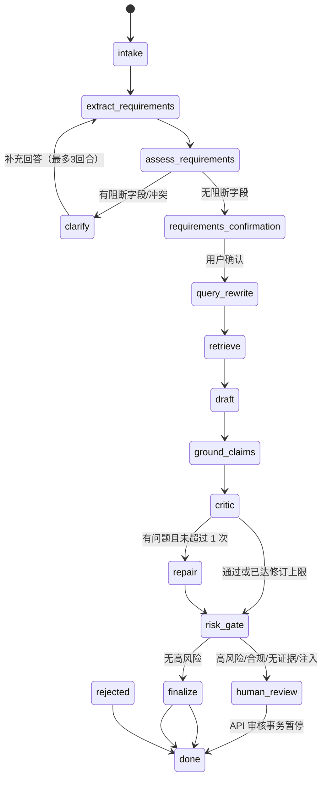

# Agent 设计与生产化边界

## 设计原则

1. **显式状态优先**：每一步都有输入、输出和可观察事件，避免一个不可解释的大 Prompt。
2. **工具最小权限**：Agent 只能搜索知识、校验证据、估算容量输入和比较部署路径；不提供任意代码执行、生产写入或外发消息工具。
3. **证据绑定**：产品能力结论必须绑定 `evidence_id` 和来源路径；没有证据时转成风险和澄清问题。
4. **人机协同**：高风险、数据出域、合规约束、疑似注入或缺少知识覆盖时暂停，等待人工审核。
5. **可恢复**：每个线程保存 checkpoint，审核后从风险门继续，而不是重新生成一份不可对比的答案。
6. **可替换模型**：应用层通过结构化契约和 OpenAI-compatible API 与 Dify、云 API、vLLM、llama.cpp 解耦。

## LangGraph 状态图

## 节点职责

| 节点 | 主要输入 | 主要输出 | 失败处理 |
|---|---|---|---|
| `intake` | `CustomerInputV2` | 长度、注入、敏感信息和输入轮次 | 阻断文本不进入模型指令或未脱敏 Replay |
| `extract_requirements` | 原始输入轮次 | `IntakeBriefV2`、`RequirementFactV2`、冲突 | source quote 不在原文中则拒绝模型结果 |
| `assess_requirements` | 抽取结果 + 字段目录 | 阻断字段、警告字段、最多 4 个问题 | 确定性计算，不让模型宣布需求完整 |
| `clarify` | `InputTurnV2` | 新的抽取和评估结果 | 最多 3 回合，幂等 + state_version |
| `requirements_confirmation` | 已无阻断的需求 | 用户确认后的 `CustomerBriefV2` | 未确认不允许检索和方案生成 |
| `query_rewrite` / `retrieve` | 需求与租户/角色 | 查询、ACL 过滤后的证据 | 空召回进入知识覆盖风险 |
| `draft` / `ground_claims` | 证据与需求 | 本地模型草案、可验证 claim | 丢弃未知 evidence ID |
| `critic` / `repair` | 草案、证据 | 问题清单、最多一次修订 | 失败进入 `model_unavailable`/审核 |
| `risk_gate` | 全部状态 | `waiting_for_review` 或放行 | 代码强制高风险停下 |
| `human_review` | 持久化状态 | reviewer、角色、理由、版本、幂等键 | 乐观锁防止重复覆盖 |
| `finalize` | 审核状态与全量状态 | `SolutionResponseV2` | schema、敏感数据和承诺策略阻断 |

## 状态与恢复

本仓库的 v2 运行时用真实 LangGraph `StateGraph` 编排节点。Compose 的 PostgreSQL 路径同时使用官方 `PostgresSaver` 保存图状态和 `interrupt/resume` token，并使用项目自己的 PostgreSQL `CheckpointStore` 保存 run-level 乐观锁、幂等键和审计事件；SQLite 单机测试保留自有 checkpoint 边界。离线展示使用脱敏 Replay，正式 API 使用 `POST /v2/projects/{project_id}/runs`，先在 `needs_clarification` 或 `ready_for_confirmation` 停下，确认后才可能进入 `waiting_for_review`。澄清和确认 API 加载相同 `run_id`，通过 checkpoint、幂等键和状态版本恢复。Compose 路径使用 PostgreSQL；SQLite 仅用于单机测试。

## LangGraph 适配边界

`src/ai_presales_copilot/llm_agent.py` 的正式路径直接构建并执行 `StateGraph`；需求抽取使用实时模型的小字段组 JSON 输出，来源、类型和完整性由主机校验。模型/schema/引用失败不会进入规则解析 fallback，而是记录 `model_unavailable` 或继续停在需求门；方案节点模型不可用时同样只把持久化状态标记为 `model_unavailable`。PostgreSQL 路径的 `clarify`、`requirements_confirmation` 和 `human_review` 节点调用 `interrupt()`，澄清、需求确认和审核 API 均以 `Command(resume=...)` 在同一 thread 恢复；项目 checkpoint 仍负责输入轮次、幂等键、reviewer、角色、理由和应用层版本，避免模型自行宣布需求完整或 `approve`。SQLite 测试路径使用相同状态语义的显式恢复分支。

面试时应展示节点边界、状态契约、审核恢复、工具权限和评测证据，而不是只展示“安装了 LangGraph”。

实现依据：[LangGraph checkpointers](https://github.com/langchain-ai/docs/blob/main/src/oss/langgraph/checkpointers.mdx) 将状态按 thread 保存，支持中断后的恢复；[LangGraph interrupt 类型说明](https://github.com/langchain-ai/langgraph/blob/main/libs/langgraph/langgraph/types.py) 明确 interrupt 需要启用 checkpointer。

## Phase 1 已完成、共享部署前仍需补齐

- API：Phase 1 已具备开发 token、租户/项目/RBAC、限流、request ID、幂等和审计事件；共享部署仍需接入 OIDC/JWT、企业目录和集中式审计访问策略。
- 数据：Phase 1 已具备来源登记、版本/hash、文档 ACL、撤回和敏感/注入隔离；生产还需完善文档权限继承、删除证明、向量生命周期和备份恢复。
- 模型：Phase 1 已记录模型 hash、量化、上下文、llama.cpp digest 和采样参数；上线前还需补齐 tokenizer/adapter 兼容矩阵、回滚和供应链签名。
- 运行：Phase 1 已有 OTel span、脱敏 JSONL、超时、有限重试和人工兜底；生产还需接入 collector、指标告警、队列、资源配额和灾备演练。
- 评测：Phase 1 已有固定案例、红队、数据集 manifest 和回归入口；生产还需扩充专家 gold、线上反馈闭环、漂移监控和发布阈值。
